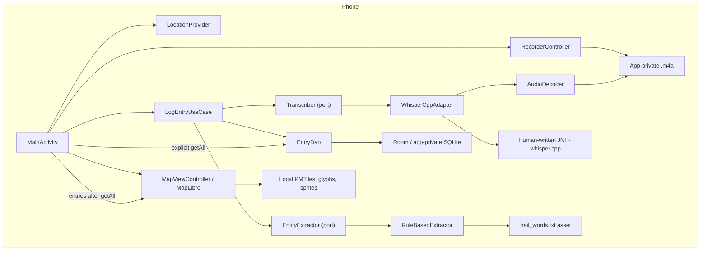

# Component diagram

All components run on the phone. JNI and whisper.cpp are supplied by the
human; no laptop or remote worker participates.

```mermaid
flowchart TD
    subgraph Phone["Phone"]
        Main["MainActivity"]
        Recorder["RecorderController"]
        Location["LocationProvider"]
        Service["LogEntryUseCase"]
        Transcriber["Transcriber (port)"]
        Whisper["WhisperCppAdapter"]
        Decoder["AudioDecoder"]
        Native["Human-written JNI + whisper.cpp"]
        Extractor["EntityExtractor (port)"]
        Rules["RuleBasedExtractor"]
        Words["trail_words.txt asset"]
        DAO["EntryDao"]
        Room["Room / app-private SQLite"]
        Map["MapViewController / MapLibre"]
        Tiles["Local PMTiles, glyphs, sprites"]
        Audio["App-private .m4a"]

        Main --> Recorder
        Main --> Location
        Main --> Service
        Main --> Map
        Recorder --> Audio
        Service --> Transcriber
        Transcriber --> Whisper
        Whisper --> Decoder
        Whisper --> Native
        Decoder --> Audio
        Service --> Extractor
        Extractor --> Rules
        Rules --> Words
        Service --> DAO
        Main -->|explicit getAll| DAO
        DAO --> Room
        Main -->|entries after getAll| Map
        Map --> Tiles
    end
```
